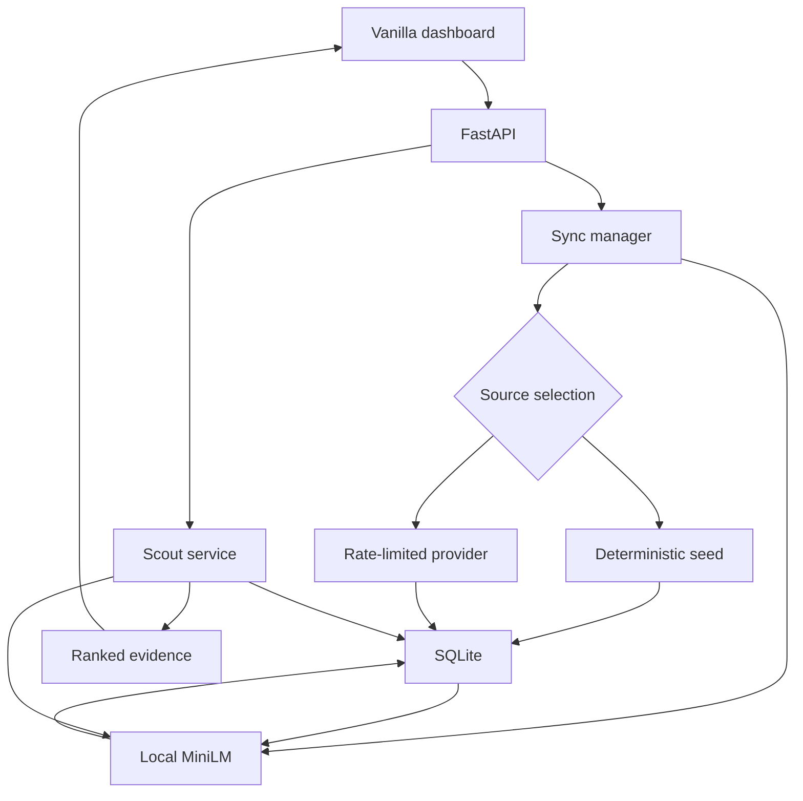

# MatchdayDB Architecture

Version 0.1 · 3 October 2026

## Stack and flow

Python 3.11+, standard-library SQLite, NumPy, FastEmbed/ONNX Runtime on CPU, HTTPX, Pydantic, FastAPI, Uvicorn, and filelock. Vanilla HTML/CSS/JavaScript is served by the Python process. There is no frontend build, remote font, or required CDN.

One local Uvicorn worker is the supported operating model. Keep SQLite on local disk. The command-line server binds to loopback. Public hosting is a separate scope requiring authentication, authorization, and operational controls.

## File structure

| Path | Responsibility |
| --- | --- |
| `app.py` | App factory, lifecycle, sync jobs, endpoints, static serving, CLI startup |
| `config.py` | Validated environment settings and position codes |
| `models.py` | Typed records, filters, date handling, Unicode normalization |
| `errors.py` | Shared safe domain errors |
| `schema.sql` | Complete initial schema and indexes |
| `database.py` | Connections, transactions, upserts, candidates, fixture revisions, vector math |
| `seed.py` | Sixty real-name synthetic profiles and sample fixtures |
| `ingestion.py` | Provider adapter, quota ledger, retries, resource validation |
| `embeddings.py` | Tactical prose, model lifecycle, fingerprints, batching, indexing |
| `scout.py` | Semantic search, player resolution, filters, statistical twins |
| `static/index.html` | Dashboard structure and accessible controls |
| `static/style.css` | Dark palette, layout, responsive behaviour |
| `static/app.js` | Same-origin requests, cards, filters, twins, dialogs, job status |
| `requirements.txt` | Application dependency constraints |
| `requirements-dev.txt` | Application requirements plus pytest and Ruff |
| `requirements-tested-py312.txt` | Exact Linux/Python 3.12 verification dependency snapshot |
| `pyproject.toml` | Pytest and Ruff configuration |
| `tests/test_backend.py` | Storage, ingestion, vector, scout, and HTTP regressions |
| `tests/test_model.py` | Opt-in real-model test with socket connections blocked |
| `.github/workflows/ci.yml` | Automated test and lint matrix |

Runtime databases are under `var/`; model assets are under `.cache/models/`. Both are ignored by Git, including SQLite auxiliary files and lock files.

## Storage contracts

The executable definitions are in [schema.sql](schema.sql).

| Table | Key and contents |
| --- | --- |
| `teams` | Team PK; name, short name, crest URL, league, source, update time |
| `players` | Player PK; identity, normalized name/nationality, position, team FK, date of birth, nullable EUR valuation, tactical bio, source, update time |
| `player_stats` | Stat PK, player FK, season, matches, minutes, goals, assists, xG, xA, progressive carries/passes, tackles, pass accuracy; unique player/season |
| `player_embeddings` | Player PK/FK; summary, 1536-byte vector, update time, model ID/version, dimension, profile hash, season |
| `player_aliases` | Composite player/alias PK; aliases may be ambiguous across players |
| `competitions` | Competition PK, code, name, update time |
| `fixtures` | Match PK; team/competition FKs; season, kickoff, status, nullable score, source/observation timestamps, payload hash, revision |
| `match_events` | Event PK; match/revision/type uniqueness; before/after JSON, observation time |
| `sync_runs` | UUID PK, state, timestamps, durable JSON report |
| `api_requests` | Attempt ID and start time for rolling quota |
| `app_meta` | Schema/source/seed/model version and refresh/backoff metadata |

Preserve every original core column. Add minutes and progressive passes to support correct rates and the dashboard. Counts must be nonnegative, pass accuracy must be in `[0,100]`, and vectors must have 384 finite components. Pydantic validates dates and finite numbers before SQL writes.

Stats represent one season aggregate per player. Demo totals are a simulated domestic-league profile. This provider adapter writes no advanced player statistics; a future real statistics adapter requires an explicit competition/source scope migration.

Unknown metrics are null. Rates are `90 * total / minutes_played`; percentage metrics are not divided by minutes. Age uses completed calendar years on `as_of`, default today in UTC. Leap-day birthdays advance on 1 March in non-leap years.

Open a connection per operation, enable foreign keys and a five-second busy timeout, and use WAL. Reads have a consistent snapshot. Writes use explicit short `BEGIN IMMEDIATE` transactions, rollback, and closure on every path. Do not perform HTTP calls, model loading, or quota waits inside a write transaction.

Initialization is repeatable and supports schema version 1. An unknown version is rejected. Future changes need ordered migrations and backups; no historical upgrade is currently claimed. A source marker prevents a demo database from being opened as API data or vice versa.

## Provider pipeline

The client uses `https://api.football-data.org/v4` and an environment-supplied `X-Auth-Token`. `/competitions` discovers resources; configured codes drive `/competitions/{code}/matches` and `/competitions/{code}/teams`; `/teams/{id}` supplies squads when entitled. Default fixtures cover yesterday through tomorrow in UTC. Explicit date ranges span at most 30 days.

Persist each request start before dispatch. At most ten attempts start per rolling 60 seconds, including retries. Persist the next allowed provider time so restarts respect backoff. Other applications sharing the key may still consume quota and trigger 429 responses.

Connection timeout is five seconds; read/write/pool timeouts are 20 seconds. Retry timeouts/network failures and HTTP 429/500/502/503/504 up to five attempts. Backoff begins at one second, doubles, and adds 0–0.25 seconds of jitter. Wait for the maximum of quota, backoff, and valid `Retry-After`. Required delays exceeding the 120-second retry-scheduling budget defer further attempts rather than shortening provider instructions. Individual in-flight calls remain bounded by transport timeouts.

401 stops the run. Resource-level failures produce partial reports. A denied squad stops probing other squads in that competition. Successful squad refreshes are cached for one day; explicit `refresh_squads` overrides that interval. Polling is optional and never overlaps jobs.

Fixture snapshots use normalized payload hashes. Unchanged snapshots create no event. Changed state advances a revision and atomically appends `fixture_created` or `fixture_changed`. Score corrections may decrease a score. A-to-B-to-A transitions retain all revisions. Source time is separate from observation time; events describe observed states, not inferred on-pitch actions.

## Jobs and recovery

`SyncManager` uses a thread guard and OS-backed file lock covering ingestion and indexing. Locks coordinate local processes and release on process exit. The next owner marks unfinished prior jobs interrupted. States are `running`, `succeeded`, `partial`, `failed`, and `interrupted`.

`POST /sync` persists a job and returns 202. A background worker ingests, reports resource outcomes, and indexes. Model failure can yield partial success without discarding ingested records. Shutdown signals cancellation, waits up to five seconds, and records incomplete work as interrupted. Third-party model loading cannot be forcibly cancelled mid-call; the owning process controls final termination.

## ML and index compatibility

Use `sentence-transformers/all-MiniLM-L6-v2` with FastEmbed and ONNX CPU inference. Deterministic template version 2 combines role, recorded bio, and known metrics. Identity, team, nationality, age, and value stay outside the semantic text.

Profiles are limited to 256 tokenizer tokens with Unicode-safe offsets. Oversized queries fail explicitly. Normalize finite, nonzero 384-vectors and store little-endian float32 BLOBs of 1536 bytes.

The model fingerprint hashes downloaded model/tokenizer/config artifacts, FastEmbed/ONNX versions, dimension, and template version. The profile hash covers semantic source values and selected season. Search requires matching source hash, season, model ID, and fingerprint. Recheck the source hash inside the save transaction to reject encoding/write races.

Index in batches of 32 and skip unchanged valid rows. Invalid vectors are rebuilt. Rebuilds replace rows incrementally; temporary mixed generations can reduce coverage, but incompatible vectors are excluded. Version 0.1 does not implement an atomic full-catalogue generation swap.

Offline mode uses FastEmbed local-files-only loading. Missing assets return `MODEL_NOT_AVAILABLE`, without invented vectors. The artifact inspection uses the tested adapter's resolved directory; library upgrades require the real-model regression test.

## Search and scoring

Validate queries of 3–1000 characters and top-k from 1 to 50. Apply parameterized SQL filters, score every eligible vector, then select top-k. Sort ties by player ID. Cosine is in `[-1,1]`; percentage bars show `100 * max(0, cosine)`.

Resolve twins by exact normalized name, then aliases. NFKC, whitespace collapse, and casefolding normalize lookup; display names retain accents. Multiple matches return candidate IDs. An explicit player ID disambiguates. Exclude the anchor and default to its broad role group; `cross_role=true` relaxes that restriction.

Hybrid score is `0.75 * ((semantic_cosine + 1) / 2) + 0.25 * ((statistical_cosine + 1) / 2)`. Numeric features are seven per-90 rates plus pass accuracy. Standardize against the anchor's role cohort before user filters. Each feature requires five known observations and nonzero variance. Compare at least four jointly known features with nonzero norms. Return components and feature names; exclude inadequate candidates explicitly. Goalkeeper quantitative twins are unavailable until keeper-specific metrics are implemented.

## HTTP contract

| Route | Request | Result |
| --- | --- | --- |
| `GET /` | None | Dashboard |
| `GET /static/{path}` | Asset path | Local HTML/CSS/JS |
| `GET /search` | Query, top-k, filters | Ranked records, source/model metadata, coverage, timing |
| `GET /similar/{player_name}` | Player ID, top-k, ranking, cross-role, filters | Anchor and twins |
| `GET /players` | Filters, limit 1–100, nonnegative offset | Alphabetical cards and total |
| `GET /options` | None | Complete player selector and filters |
| `GET /fixtures` | None | Six latest stored snapshots |
| `GET /health` | None | Source, counts, readiness, latest job |
| `POST /sync` | JSON date window, refresh-squads, or index-only options | 202 job ID and status URL |
| `GET /sync/{run_id}` | UUID | Persisted job report |
| `GET /openapi.json` | None | API schema without a remote UI dependency |

Filters are maximum age 14–60, canonical position, nationality, team ID, league, and `as_of`. Invalid ranges/positions return 422. Unknown country or league values match no rows. Valid empty searches succeed. Missing player/job is 404; ambiguity/concurrent sync is 409; model/index/storage unavailability is 503.

Errors use `error.code`, `message`, `retryable`, `details`, and `request_id`. The loopback host allowlist and same-origin JSON-only writes reduce unintended browser-origin access. Do not expose secrets, full provider payloads, vectors, or raw stack traces in responses.

## Primary references

Checked 3 October 2026. Recheck provider entitlements during integration work.

- [Provider policies](https://docs.football-data.org/general/v4/policies.html)
- [Provider plans](https://www.football-data.org/pricing)
- [Competition resource](https://docs.football-data.org/general/v4/competition.html)
- [Team resource](https://docs.football-data.org/general/v4/team.html)
- [Match resource](https://docs.football-data.org/general/v4/match.html)
- [FastEmbed supported models](https://qdrant.github.io/fastembed/examples/Supported_Models/)
- [MiniLM model card](https://huggingface.co/sentence-transformers/all-MiniLM-L6-v2)
- [SQLite WAL](https://www.sqlite.org/wal.html)
- [Python sqlite3](https://docs.python.org/3.11/library/sqlite3.html)
- [FastAPI static serving](https://fastapi.tiangolo.com/tutorial/static-files/)
- [filelock](https://py-filelock.readthedocs.io/en/latest/)
