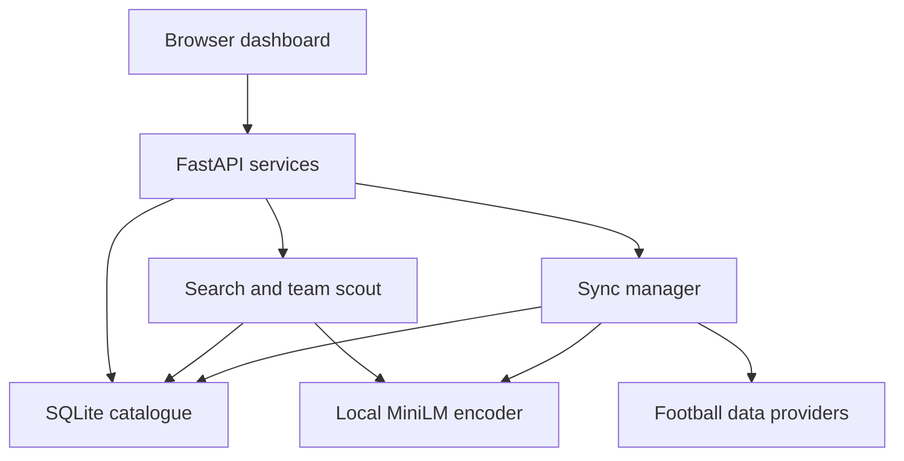

# MatchdayDB Architecture

## Runtime and app flow

A single FastAPI process owns an active service bundle: validated settings, a provider-specific SQLite database, a local embedder, a scout and a sync manager. Browser requests capture the bundle once per request. Provider switching validates the new connection before replacing the active bundle and is rejected while a synchronization is running.

The model loads on demand. Background synchronization runs with a process guard and file lock. Stored jobs report running, succeeded, partial, failed or interrupted. Optional polling does not overlap jobs. The application serves `/` and mounts local assets at `/static`.

## Technology

| Layer | Choice |
| --- | --- |
| Runtime | Python 3.11+ |
| HTTP app | FastAPI, Uvicorn, Pydantic |
| Provider transport | HTTPX with fixed provider hosts, bounded retries and persisted quota accounting |
| Storage | SQLite WAL, foreign keys, transactions and typed parameterized upserts |
| Vectors | 384 normalized float32 components in a BLOB; exact NumPy cosine |
| Encoder | FastEmbed, sentence-transformers/all-MiniLM-L6-v2, CPU ONNX Runtime |
| Frontend | Vanilla HTML, CSS and JavaScript; system fonts; no build step |
| Synchronization | Thread worker, filelock, durable job and resource reports |
| Verification | pytest, Ruff, browser smoke checks |

## Files

| Path | Responsibility |
| --- | --- |
| `app.py` | Service lifecycle, endpoints, source switching, security headers, static serving and CLI |
| `config.py` | Environment validation, competition constants (all 12 football-data.org free-tier competitions) and effective season |
| `models.py` | Validated records, requests, normalized names and scalar filter types |
| `errors.py` | Safe domain error contract |
| `schema.sql` | Complete schema version 2 |
| `database.py` | Migration, transactions, data provenance, memberships, vectors and candidate SQL |
| `ingestion.py` | Quota/retry client, resume cache and football-data.org adapter |
| `seed.py` | Deterministic historical synthetic dataset |
| `embeddings.py` | Tactical prose, model fingerprinting, batched indexing and stale checks |
| `scout.py` | Name resolution, semantic search, twins, public profiles and statistical ranking |
| `team_scout.py` | Explainable squad audit, evidence thresholds and candidate recommendations |
| `static/index.html` | Accessible controls and four workspace views |
| `static/style.css` | Neutral themes, responsive layout and components |
| `static/theme.js` | Apply theme preference before first paint |
| `static/app.js` | Safe DOM rendering, requests, cancellation, sorting, dialogs, forms and sync status |
| `tests/test_backend.py` | Original ingestion, SQLite, embeddings and API contracts |
| `tests/test_updates.py` | Provider, migration, search, sorting, connection and squad-audit regressions |
| `tests/test_model.py` | Optional real CPU encoder check with blocked network sockets |
| `.github/workflows/ci.yml` | Python 3.11/3.12 checks across Linux, macOS and Windows |
| `requirements*.txt`, `pyproject.toml` | Dependencies, tested environment and tool configuration |
| Six planning documents and README | Requirements, architecture, contributor rules, roadmap, design and handoff |

## Storage and migration

The relational core is `teams`, `players`, `player_stats` and `player_embeddings`. Supporting tables store aliases, competitions, fixtures, observed match revisions, sync jobs, quota attempts and metadata. Version 2 adds rating/source/timestamp/team association fields, active membership, per-league status, per-team squad timestamps and resumable provider pages.

An existing schema-version-1 database migrates transactionally before use. Provider and synthetic source markers prevent accidental mixing. A new provider uses a separate file because numeric IDs are provider-specific. Historical player rows remain stored after departure but inactive rows are excluded from the catalogue.

Stats are selected for each team's recorded league season. A known `stats_team_id` must match the current club, preventing old-club numbers from appearing as current-club statistics. A complete validated nonempty squad replaces membership atomically. Empty or malformed snapshots retain prior membership. Club lists remove relegated/out-of-scope clubs from the active league view.

## Ingestion contracts

football-data.org discovers the current season from the catalogue/resource. It refreshes squad membership, ingests supplied scorer entries and polls fixtures. Scorer-feed absence is not a zero statistic. Unsupported advanced fields (ratings, xG, xA, minutes, tackles, pass accuracy, progressive actions) remain null rather than estimated.

Resumable pages from an incomplete run are cached for up to 48 hours, so a retried import does not re-spend quota on already-completed pages.

The client counts retries toward the local quota. The default ceiling is ten request starts per rolling minute. Attempts have a 120-second scheduling budget, five-attempt maximum, jittered exponential delays, Retry-After support and bounded connect/read timeouts. Permanent authentication failures are not retried as transient errors.

API-Football support (a second live provider) was implemented and later removed at the user's request, to keep a single, simpler provider integration.

## Retrieval and numerical semantics

Catalogue search uses normalized names and escaped SQL LIKE patterns. Team, league, nationality, age and position predicates combine before profile rendering. Sort identifiers are validated literals; the response orders the complete filtered set before pagination. Null values are last in either direction.

Per-90 values equal `90 × total / minutes`, only when the total is known and minutes are positive. Tactical descriptions use only recorded fields. Model artifact hashes, template version, engine version, season and profile hash determine index compatibility. Stale vectors are excluded and raced writes are rejected.

Semantic search uses cosine similarity after scalar filtering. Display percentages are `100 × max(0, cosine)`. Twins exclude the anchor, compare within the broad role by default, and support optional 75% normalized semantic plus 25% normalized statistical similarity. Hybrid ranking requires four comparable features and five observations per standardized feature. These scores are not probability estimates or quality ratings.

Provider ratings are stored separately as nullable 0–10 values with a source label. Goalkeeper hybrid ranking is not supported by the outfield feature set.

## Team scout

Depth and succession checks require a confirmed current-season roster and explicit coverage thresholds. Performance checks use minutes-weighted broad-role rates, 450-minute player samples and five peer clubs in the same league and season. Only sufficiently low observed values trigger performance indicators.

Each issue includes a rule, evidence, comparison baseline, candidate count and ranking basis. Candidate players must be outside the selected club. Performance candidates must exceed the observed rate with enough minutes. Depth candidates are ordered by known provider rating, then name. Succession candidates are 25 or younger. There is no invented transfer-fit probability. Missing evidence produces a skipped check rather than an inferred weakness.

## HTTP and security boundaries

Endpoints include `/players`, `/search`, `/similar/{player_name}`, `/teams/{team_id}/needs`, `/options`, `/fixtures`, `/health`, `/data/connect`, `/sync`, `/sync/{run_id}` and `/openapi.json`.

Errors contain a safe code, message, retryable flag, request ID and limited structured details. Raw credentials and response bodies are not included in logs or errors. POST requests require JSON and reject cross-origin browser requests. Trusted hosts restrict loopback use. CSP prevents external scripts and frames; the frontend uses text/value DOM APIs.

The local connection form stores its key in server memory only. Theme preference is the only browser-storage setting. Requests are cancellable and stale responses are ignored. The app is intentionally a local single-user service; an internet deployment needs an additional authentication and operational design.
